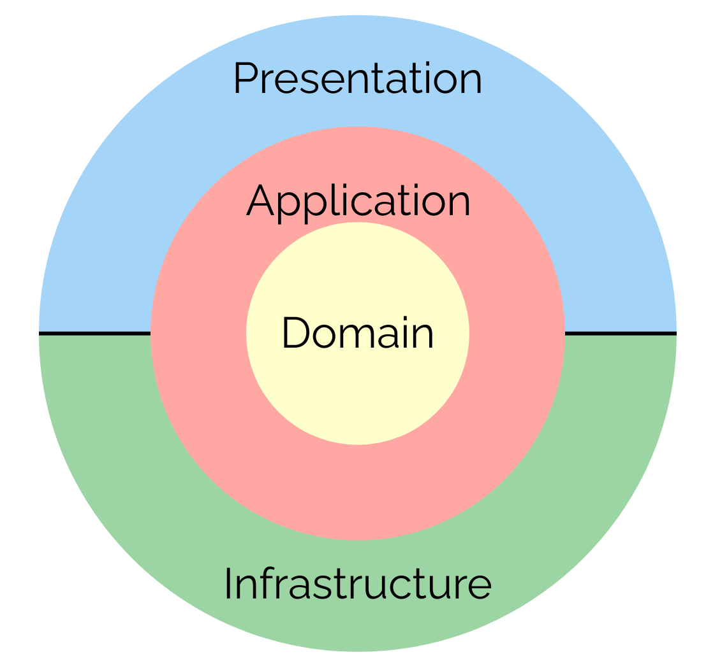
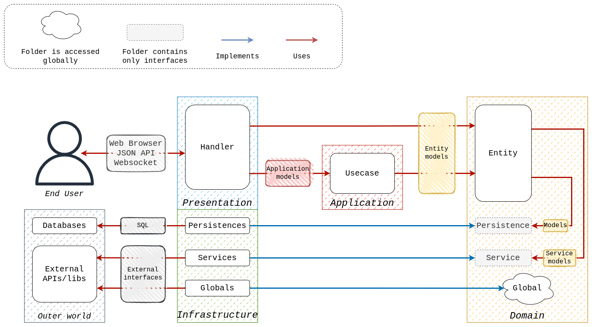

# netsly-golang

_Work in progress_

## Description

Netsly is a social network based on the idea of sharing and discussing jokes. It can be used through multiple entrypoints, such as a traditional REST/WebSocket API, SSR (server side rendering) web application, and as a gRPC API.

## Architecture

The project is built based on the Clean Architecture paradigm.

Here’s the circle diagram of the Architecture:



The Clean Architecture separates the concerns into different layers which helps to test, maintain, and modify code more easily.The Clean Architecture allows business logic and presentation not to be dependent on specific implementations, but to depend on abstractions defined in the Domain layer.

The following architecture sketch describes the relationships between the layers:



## Key technologies

The following list describes technologies used in the project:

- All the main code is written in Golang.
- [Air](https://github.com/air-verse/air) is used for live-reloading.
- For configuration `.env` files are used.
- The project is containerized and can be run with Docker.
- Makefiles are not used in the project. [Task](https://taskfile.dev/) is used as a task runner.

- Domain layer:

  - The project is instrumented with [OpenTelemetry](https://opentelemetry.io/). The LGTM Grafana stack is used as a backend and frontend for the OpenTelemetry.
  - [Playground-Validator](https://github.com/go-playground/validator) is used for validation.
  - [Mockery](https://github.com/vektra/mockery) is used for mock generation.

- Persistence layer:

  - Sqlite is used as a database.
  - Bun and Gorm are used as ORM libraries (either can be used).

- Presentation layer:

  - For the REST API, the [OpenAPI](https://learn.openapis.org/) and [AsycAPI](https://www.asyncapi.com/en) specifications are use for documentation. [Ogen](https://github.com/ogen-go/ogen) library is user as the code generator for the REST API.
  - For the SSR web application, golang html/template library is used with the use of [HTMX](https://htmx.org/) and [Tailwind CSS](https://tailwindcss.com/).
  - For the gRPC API, the [gRPC framework](https://grpc.io/) is used with additional tools by [Buf](https://buf.build/).

## Development

The project is supposed to be developed inside a devcontainer, but it can be run locally as well.

### Dev Container setup

#### Requirements

Ensure you have the following installed:

- `docker`
- VSCode with the Dev Containers extension installed

#### Initialise

Firstly you need to clone the repo. After that, open the project in VSCode and click on the "Reopen in Container" button in the Remote Explorer menu.

The Dev Container will be built and you will be able to start developing.

Also, you can provide your own dotfiles by using [this](https://code.visualstudio.com/docs/devcontainers/containers#_personalizing-with-dotfile-repositories) VSCode feature.

### Local setup

#### Requirements

Ensure you have the following installed:

- `go`
- `docker`
- `task`
- `npm`

#### Initialise

Firstly you need to clone the repo. After that, you need to run the following script:

```
bash .devcontainer/post-create.sh
```

It will prepare the environment for you.

## Project Folder structure

All the Golang code is placed in the **internal** folder. The layers hierarchy matches the folder structure.

#### Domain directory

The Domain folder contains abstractions for the app infrastructure, business and validation logic:

- The **Persistence directory** provides an abstraction for the datasource operations.
- The **Services directory** provides abstractions for the 3rd-party libraries, external APIs, etc. Using these interfaces allows the Domain/Application layer not to be dependent on the specific libs/APIs, so they can easily be changed.
- The **Global folder** contains the singletons for the application. They can be accessed from any part of the application.
- The **Model folder** contains the declarations of the business entities' structure. Note, that the Models have the same structure, as they have in the datasource, so the Models will be returned from the datasourse operations.
- The **Entity directory** contains basic business rules: all the validation logic, logic for creating/updating/deleting them (some additional logic may be present too).

As was said earlier, the Domain layer knows nothing about other layers, so no packages from other layers can be used here.

##### Domain/Persistence directory

The Persistence directory is an abstraction for any datasource being used. It contains interfaces for accessing the datasource.

For the separation of concerns, the CQRC (Command Query Responsibility Segregation) pattern is used. It divides traditional Repositories into two independent structures:

- **Commands** – to modify the content of the datasource;
- **Queries** – to query the datasource.

Also, the **db.go file** is present in this folder. It contains the abstraction for the datasource (so that many datastores can be used simultaniously without the Domain knowing about it), which is used for performing transactions.

#### Application directory

The Application directory contains the main business logic of the application. It uses _entities_ from the Domain layer as an abstraction for the Infrastructure.

The business logic is divided into **UseCases** (units of business logic). Each Use Case defines similar/related operations.

#### Infrastructure directory

The Infrastructure directory contains the implementations for the interfaces defined in the domain layer. Here multiple implementations of the certain interface can be defined (the concrete implementation is injected with the use of .env file).

The Domain Layer doesn’t know anything about the implementations, so changing one implementation for another (or introducing new implementations) will affect only this layer.

#### Presentation directory

The Presentation directory contains the app’s frontend. This layer uses abstractions from the Domain layer and Use Cases from the Application layers. The Presentation doesn’t know anything about specific implementations.

### Tests

The two types of tests are used in the project:

- Unit tests, which are written for the Application layer only. They are located near the with the code they are testing and have the same name as the tested file, but with the `_test` suffix.
- Integration tests, which are written for the Entity layer. They are located in the `test` folder. Note, that to choose the dependencies for the integration tests, the separate .env should be created.

### Other

The `cmd` directory contains the entry point of the application.

The `gen` folder contains the generated code.

The `infra` directory contains all the infrastructure for the application (databases, queues, etc.). Inside the `infra/local` folder the local infrastructure is located, it's managed by the application (sqlite files, logs output, etc.). All other infrastructure is managed by the Terraform, which configuration is located in the `infra/terraform` directory.

The `tools` directory contains the binaries for the project ([more on this technique](https://www.tiredsg.dev/blog/golang-tools-as-dependencies/)).
