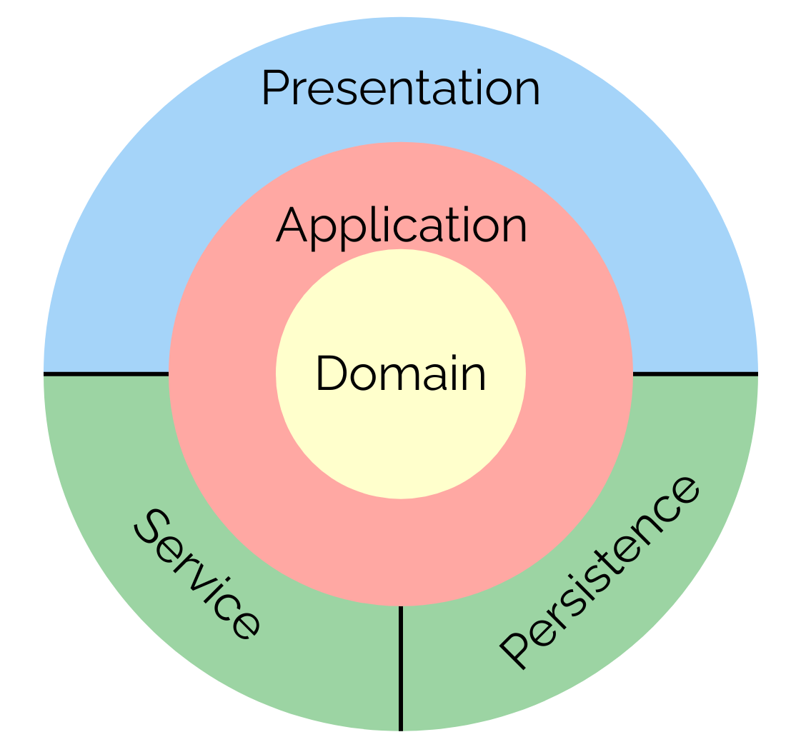

# netsly-golang

_Work in progress_

## Description

Netsly is a social network based on the idea of sharing and discussing jokes. It can be used through multiple entrypoints, such as a traditional REST/WebSocket API, SSR (server side rendering) web application, and as a gRPC API.

## Architecture

The project is built based on the Clean Architecture with the use of Domain Driven Design patterns.

Layers of the application can be shown as follows:



All the code is located in the `internal` directory. The `cmd` directory contains the entry point of the application.

## Key technologies

The following list describes technologies used in the project:

- All the main code is written in Golang.
- The project is not using Makefiles, but instead, it uses [Task](https://taskfile.dev/) as a task runner.
- For configuration `.env` files are used.
- The project is containerized and can be run with Docker or Podman.

- Persistence layer:

  - [Ent](https://github.com/ent/ent) is used as an ORM.
  - PostgreSQL is used as a database.
  - Redis is used as a cache.

- Service layer:

  - ElasticMail is used as an email api.
  - [Asynq](https://github.com/hibiken/asynq) library with Redis database is used as a task queue.
  - JWT tokens are used for authentication.

- Presentation layer:

  - For the REST API, the OpenAPI specification is used for generating code and documentation ([ogen](https://github.com/ogen-go/ogen) library is user as the code generator).
  - For the SSR web application, golang html/template library is used with the use of HTMX and Tailwind.
  - For the gRPC API, the gRPC framework is used with additional tools by [Buf](https://buf.build/).

## Initial setup

1. Make sure the correct version of go is installed on your machine
2. Install Podman
3. Install Task
4. Clone the repo
5. Run `git config --local core.hooksPath .githooks` in the root of the project
6. Create .env (or dev.env) file. Project should be launched with the correct environment set.

### Formatters setup

Prettier extension should be installed. And the `.prettierrc` file should be created in the project root.

The contents of the .prettierrc should be as follows:

```json
{
  "plugins": ["prettier-plugin-go-template", "prettier-plugin-tailwindcss"],
  "overrides": [
    {
      "files": ["*.html"],
      "options": {
        "parser": "go-template"
      }
    }
  ]
}
```

#### Golang Templates formatter

https://github.com/NiklasPor/prettier-plugin-go-template

Command to install prettier plugin: `npm install --save-dev prettier prettier-plugin-go-template`

#### Tailwind CSS formatter

https://tailwindcss.com/docs/editor-setup

Command to install prettier plugin: `npm install --save-dev prettier-plugin-tailwindcss`
